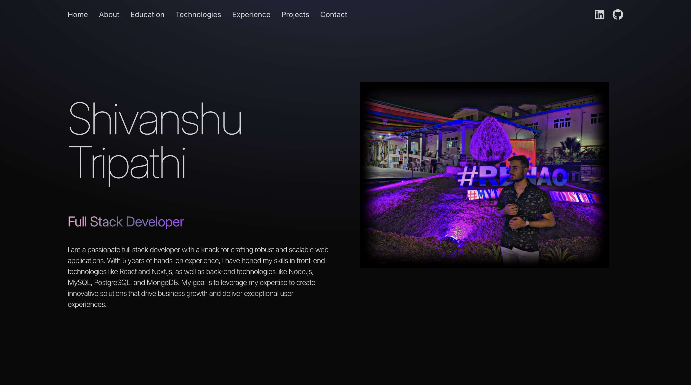

# 🚀 Personal Portfolio Website

A modern, responsive personal portfolio website built with React, Vite, and Tailwind CSS featuring smooth animations and clean design.



## ✨ Features

- 🎨 **Modern Design** - Clean and professional layout
- 📱 **Fully Responsive** - Works on all devices
- ⚡ **Fast Loading** - Built with Vite for optimal performance
- 🎯 **Smooth Animations** - Framer Motion animations
- 🧭 **Smooth Scrolling** - Custom scroll navigation
- 💨 **Tailwind CSS** - Utility-first CSS framework
- 🔧 **Code Quality** - ESLint + Prettier for clean code
- 🎪 **Interactive Elements** - Hover effects and transitions

## 🛠️ Tech Stack

- **Frontend Framework:** [React 18](https://reactjs.org/)
- **Build Tool:** [Vite](https://vitejs.dev/)
- **Styling:** [Tailwind CSS](https://tailwindcss.com/)
- **Animations:** [Framer Motion](https://www.framer.com/motion/)
- **Icons:** [React Icons](https://react-icons.github.io/react-icons/)
- **Code Quality:** ESLint + Prettier
- **Package Manager:** npm

## 🚀 Getting Started

### Prerequisites

- Node.js (v18 or higher)
- npm or yarn

### Installation

1. **Clone the repository**

   ```bash
   git clone https://github.com/tshivanshu9/portfolio.git
   cd portfolio
   ```

2. **Install dependencies**

   ```bash
   npm install
   ```

3. **Start the development server**

   ```bash
   npm run dev
   ```

4. **Open your browser**
   Navigate to [http://localhost:5173](http://localhost:5173)

## 📁 Project Structure

```
portfolio/
├── public/
│   ├── portfolio.svg          # Favicon
│   └── vite.svg
├── src/
│   ├── assets/               # Images and media files
│   │   ├── projects/         # Project screenshots
│   │   ├── myProfilePic1.jpg
│   │   └── about.jpg
│   ├── components/           # React components
│   │   ├── Navbar.jsx       # Navigation bar
│   │   ├── Hero.jsx         # Hero section
│   │   ├── About.jsx        # About section
│   │   ├── Education.jsx    # Education section
│   │   ├── Technologies.jsx # Tech stack showcase
│   │   ├── Experience.jsx   # Work experience
│   │   ├── Projects.jsx     # Projects showcase
│   │   └── Contact.jsx      # Contact information
│   ├── constants/           # App constants
│   │   └── index.js         # Portfolio data
│   ├── hooks/               # Custom React hooks
│   │   └── useScrollToSection.js
│   ├── App.jsx              # Main app component
│   ├── main.jsx             # App entry point
│   ├── index.css            # Global styles
│   └── style.css            # Tailwind imports
├── .eslintrc.js             # ESLint configuration
├── .prettierrc              # Prettier configuration
├── tailwind.config.js       # Tailwind configuration
├── vite.config.js           # Vite configuration
└── package.json
```

## 🎨 Sections

### 🏠 Hero Section

- Professional introduction
- Animated name display
- Role with gradient text effect
- Profile image with animation

### 👨‍💻 About Section

- Personal background
- Professional summary
- Animated content reveal

### 🎓 Education Section

- Academic background
- Relevant coursework
- Achievements

### 🛠️ Technologies Section

- Tech stack showcase
- Animated floating icons
- Technology expertise levels

### 💼 Experience Section

- Work history
- Project contributions
- Professional achievements

### 🚀 Projects Section

- Portfolio projects
- Project descriptions
- Technology tags
- Visual project previews

### 📧 Contact Section

- Contact information
- Social media links
- Professional networking

## 🎯 Key Features

### Smooth Scrolling Navigation

- Custom scroll hook implementation
- Smooth page transitions
- Mobile-responsive navigation

### Responsive Design

- Mobile-first approach
- Flexible grid layouts
- Optimized for all screen sizes

### Animation System

- Framer Motion integration
- Scroll-triggered animations
- Hover effects and transitions

### Performance Optimizations

- Code splitting
- Lazy loading
- Optimized bundle size

## 🎨 Customization

### Colors

The project uses a neutral color palette with purple accents:

- Primary: `text-neutral-300`
- Accent: `text-purple-800`
- Background: `bg-neutral-950`

### Typography

- Font: System fonts with fallbacks
- Sizes: Responsive typography scale
- Weights: Light to bold variants

### Animations

- Duration: 300ms to 1.5s
- Easing: Custom cubic-bezier functions
- Triggers: Scroll-based and hover interactions

## 📦 Available Scripts

```bash
# Development
npm run dev          # Start development server
npm run build        # Build for production
npm run preview      # Preview production build

# Code Quality
npm run lint         # Run ESLint
npm run format       # Format code with Prettier
npm run format:check # Check code formatting
```

## 🌐 Deployment

### Build for Production

```bash
npm run build
```

### Deploy to Netlify

1. Build the project
2. Upload `dist` folder to Netlify
3. Configure build settings:
   - Build command: `npm run build`
   - Publish directory: `dist`

### Deploy to Vercel

1. Connect your GitHub repository
2. Configure build settings:
   - Framework: Vite
   - Build command: `npm run build`
   - Output directory: `dist`

## 🔧 Configuration

### Tailwind CSS

Custom configurations in `tailwind.config.js`:

- Custom colors
- Animation extensions
- Responsive breakpoints

### ESLint & Prettier

Code quality tools configured for:

- React best practices
- Consistent formatting
- Import organization

## 📱 Browser Support

- Chrome (latest)
- Firefox (latest)
- Safari (latest)
- Edge (latest)

## 🤝 Contributing

1. Fork the repository
2. Create a feature branch (`git checkout -b feature/amazing-feature`)
3. Commit your changes (`git commit -m 'Add some amazing feature'`)
4. Push to the branch (`git push origin feature/amazing-feature`)
5. Open a Pull Request

## 📄 License

This project is licensed under the MIT License - see the [LICENSE](LICENSE) file for details.

## 👨‍💻 Author

**Shivanshu Tripathi**

- GitHub: [@tshivanshu9](https://github.com/tshivanshu9)
- LinkedIn: [shivanshu-tripathi-7a043327b](https://www.linkedin.com/in/shivanshu-tripathi-7a043327b/)
- Email: tshivanshu9@gmail.com

## 🙏 Acknowledgments

- Design inspiration from modern portfolio websites
- Icons from [React Icons](https://react-icons.github.io/react-icons/)
- Animations powered by [Framer Motion](https://www.framer.com/motion/)

---

⭐ **If you found this project helpful, please give it a star!**
